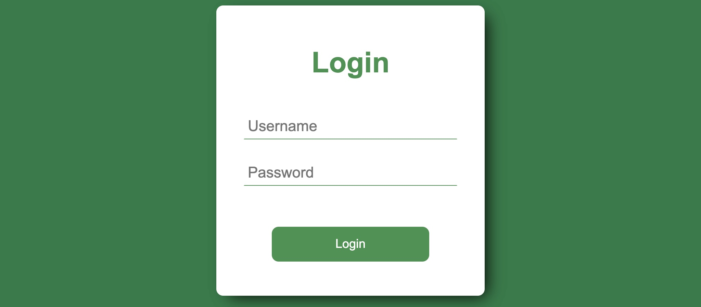

# idattend-student-voting
Student leader voting website with IDAttend integration

## Photos
Screenshot of login page

Screenshot of voting page

Screenshot of submission page

## Instructions

### Downloading
1. From the repository homepage on GitHub, click the green "Code" button. Then, click "Download ZIP".

1. Unzip the downloaded file into a new directory.

1. Navigate to the folder and open it in windows explorer. Then, follow the instructions below.

### Config
1. Right-click config.js and click *Edit with Notepad++*

1. Under the *Candidate students* heading, fill in the names of the candidates for the voting session.

1. Under the *Server settings* heading, replace `EQGBN9999005` with the name of your IDAttend server.

1. Under the *Server settings* heading, replace `GBN` with the login domain for your network.

1. Delete the `votes` folder if it exists. This folder contains the results for the previous voting session.

### Running
1. Shift-right-click the folder and click *Open Command Prompt window here* or *Open Powershell window here*.

1. Type in `npm install` to install the required dependencies.

1. Type in `node .` to start the voting website.

1. Enter your username and password as prompted.

1. The address to type into the web broswer will appear. Give this address to the students to vote with.

1. Students log in with their login domain's username and password.

1. Keep the Command Prompt or Powershell window open for the duration of the voting.

### Getting the results
1. Shift-right-click the folder and click *Open Command Prompt window here* or *Open Powershell window here*.

1. Type in `node . --csv` to create an excel file containing the results.

1. The excel file will be saved as `votes.csv` in the folder.